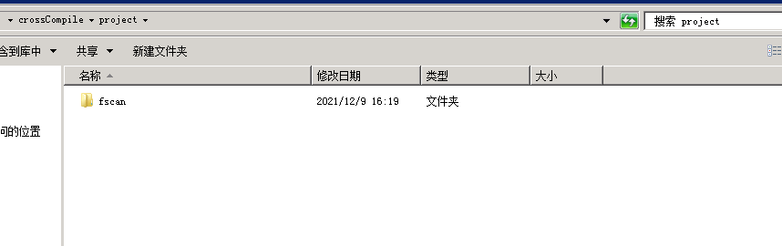
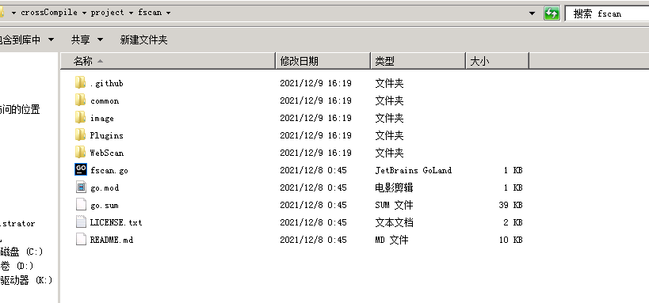
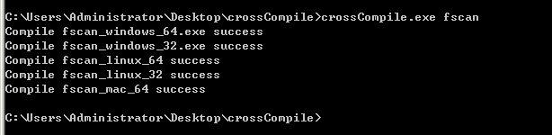
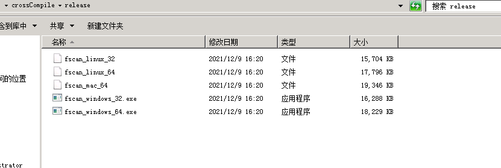

## 交叉编译工具
    本项目基于命令去编译各种环境的可执行文件
    搞红队的朋友都喜欢把要传到受害者机器上的可执行文件都重新编译，防止被杀软简单标记哈希
    该项目就是为了方便重新编译制作
## 前提
安装go并且加入环境变量中！！！！

## 使用
    这边举例子说明使用方法

比如说我要将fscan加进我们的可供选择编译选项中

我们首先下载fscan,然后改名称fscan放置在project

然后fscan原来的main.go改成fscan.go，名字跟项目名一致

然后我们就可以开始使用了
crossCompile.exe 项目名
使用上面命令即可进行编译，编译成功会在release目录下面输出编译好的文件

